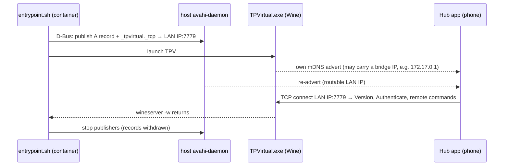

# 0001. Re-advertise TPV's `_tpvirtual._tcp` service from the container so the Hub app can connect

- **Status:** Accepted
- **Date:** 2026-09-17
- **Deciders:** Ben Atkinson
- **Feature / area:** hub-app-discovery
- **Builds on:** none — first ADR for hub-app-discovery
- **Supersedes / Superseded by:** none

## What problem were we trying to solve?

We wanted handlebar control of TPV's virtual gears and workout intensity (#3).
TPV runs under Wine, which has no BLE, so a Zwift Click can't pair directly.
TrainingPeaks' own companion app, **Hub**, has an In Game remote with Gear
Up/Down and Difficulty −/+, and it needs no extra hardware or licence.

Hub finds TPV over mDNS (`_tpvirtual._tcp`, TXT `txtvers=1`) and connects
**in** to TPV on TCP 7779. Every network path this container already relied on
(DIRCON from QZ, BikeControl) runs the other way, with TPV discovering and
connecting out.

On the laptop, Hub's Live tab kept saying "start a ride" during an active ride.
We found:

- The firewall wasn't the cause: Fedora Workstation's default zone allows
  1025–65535 and IPv4 multicast.
- TPV under Wine *did* listen on `0.0.0.0:7779`, and *did* publish its own
  advert through its own 5353 sockets.
- But the advert resolved to **`172.17.0.1`**, the address of `docker0` (link
  down, Docker running on the host), not the Wi-Fi address. Hub found TPV and
  couldn't reach it. This is the same kind of fault as the DIRCON advert
  address problem: TPV under Wine picks the wrong adapter's address.

The fix had to work for every user of the repo, whatever bridges they have
(Docker, libvirt, Waydroid, Tailscale), without touching TPV, which is
proprietary.

## What did we try?

### Attempt 1: open firewall ports ❌ rejected up front

TrainingPeaks' troubleshooting says to open TCP 7779 and UDP 5353. Checking the
laptop showed both were already allowed, so the firewall was never the blocker.

### Attempt 2: manual host-side re-advert ✅ proved the fix

On the laptop, without touching the running container:

```
avahi-publish -a -R tpv-laptop.local 192.168.0.146
avahi-publish-service -H tpv-laptop.local "FEDORA LAN" _tpvirtual._tcp 7779 txtvers=1
```

Hub connected at once. TPV's log showed `accepted new connection from
192.168.0.105` / `Authentication Success`, and the In Game remote moved the
rider. **Hub picked the reachable entry even though TPV's broken `FEDORA` advert
was still published**, so we don't need to suppress TPV's own advert. The one
open question is a single "Lost heartbeat" drop 30 s into the first connection;
the phone reconnected by itself.

This is manual and doesn't survive a reboot, so it isn't a solution for other users.

### Attempt 3: remove the bridge so TPV advertises correctly ❌ not chosen

Stopping Docker or deleting `docker0` might make TPV pick the Wi-Fi address. We
rejected this as the fix because:

- It changes the user's host.
- It only covers Docker, not the other bridges that could win instead.
- It needs a TPV restart to test (that would have interrupted the #5 soak session).
- It relies on undocumented Wine adapter-enumeration order.

It's still worth investigating as a root cause, but the re-advert is needed either way.

### Attempt 4: publish from `run-tpv.sh` on the host ❌ not chosen

This would avoid an image change. But `run-tpv.sh` `exec`s podman, so it would
have to stop doing that and manage background publishers and traps itself. It
would also depend on the host having `avahi-tools` installed. Publishing inside
the container ties the advert's lifetime to TPV's automatically.

## What did we land on, and why?

`scripts/entrypoint.sh` runs `advertise_hub` just before launching TPV, and
stops it after `wineserver -w`:

- **Address:** `TPV_HUB_ADDR`, or the source address of the default route
  (`ip -4 route get 1.1.1.1`).
- **Records:** A record `<hostname>-tpv-<last octet>.local`. The octet prevents
  clashes between hosts with the same name; the desktop and laptop are both
  `fedora`. Service record `<hostname> (LAN)._tpvirtual._tcp` port 7779,
  `txtvers=1`.
- **How it publishes:** `avahi-publish` / `avahi-publish-service` (new
  `avahi-utils` package in the image) talk to the **host's** avahi-daemon over
  the system D-Bus socket the container already mounts for BlueZ.
- **Failure handling:** if avahi is unavailable or a name clashes, it prints a
  warning and TPV still starts. `TPV_HUB_ADVERT=0` disables it.
- **Checking:** `verify.sh` check 6 flags each `_tpvirtual._tcp` IPv4 entry as a
  host LAN address or not.

This was chosen because it's the approach proven on real hardware (Attempt 2),
needs no host changes, works whatever bridge TPV happens to pick, and is
harmless if TPV's own advert is correct: Hub just sees a duplicate.



We'd revisit this if TPV starts advertising the right address under Wine, or if
Hub starts preferring TPV's own entry over ours.

## What does this cost us?

- **Image rebuild:** `avahi-utils` is added to the runtime apt layer, which
  invalidates the Wine and prefix layers after it.
- **Duplicate entries:** two `_tpvirtual._tcp` instances appear on the LAN
  while TPV runs. Hub copes today; a future Hub version might not.
- **Address fixed at start-up:** if the host changes networks mid-ride (say,
  garage vs house Wi-Fi, which are different subnets), the advert is stale
  until TPV restarts. Multi-homed hosts may need `TPV_HUB_ADDR`.
- **IPv4 only:** deliberate, given TPV's unscoped `fe80::` bug seen with DIRCON
  (#5) and BikeControl (bikecontrol#366).
- **More host coupling:** the container now also publishes on the host's mDNS,
  on top of reading it.
- **Follow-up:**
  - End-to-end test after the rebuild.
  - A 60-minute ride watching for "Lost heartbeat" drops.
  - Optionally, find out why Wine exposes `docker0` first.
