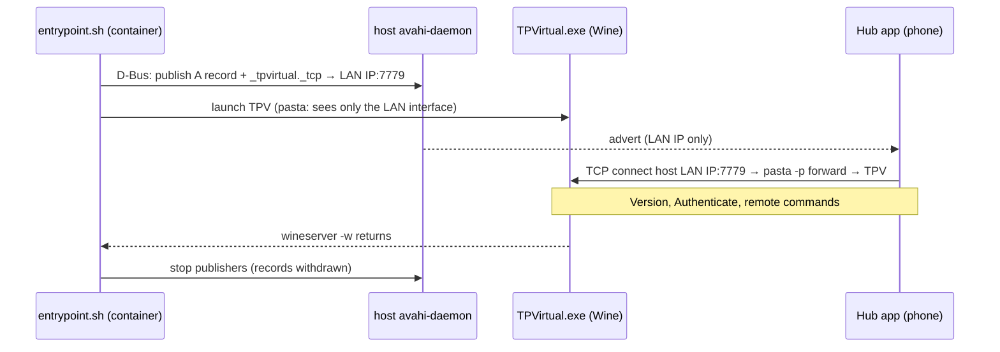

# 0001. Run TPV on pasta networking and re-advertise `_tpvirtual._tcp` so the Hub app connects promptly

- **Status:** Accepted
- **Date:** 2026-09-17
- **Deciders:** Ben Atkinson
- **Feature / area:** hub-app-discovery
- **Builds on:** none — first ADR for hub-app-discovery
- **Supersedes / Superseded by:** none

## What problem were we trying to solve?

We wanted handlebar control of TPV's virtual gears and workout intensity (#3).
TPV runs under Wine, which has no BLE, so a Zwift Click can't pair directly.
TrainingPeaks' own companion app, **Hub**, has an In Game remote with Gear
Up/Down and Difficulty −/+, and it needs no extra hardware or licence.

Hub finds TPV over mDNS (`_tpvirtual._tcp`, TXT `txtvers=1`) and connects
**in** to TPV on TCP 7779. Every network path this container already relied on
(DIRCON from QZ, BikeControl) runs the other way, with TPV discovering and
connecting out.

On the laptop, Hub's Live tab kept saying "start a ride" during an active ride.
We found:

- The firewall wasn't the cause: Fedora Workstation's default zone allows
  1025–65535 and IPv4 multicast.
- TPV under Wine *did* listen on `0.0.0.0:7779`, and *did* publish its own
  advert through its own 5353 sockets.
- But the advert resolved to **`172.17.0.1`**, the address of `docker0` (link
  down, Docker running on the host), not the Wi-Fi address. Hub found TPV and
  couldn't reach it. This is the same kind of fault as the DIRCON advert
  address problem: TPV under Wine picks the wrong adapter's address.

The fix had to work for every user of the repo, whatever bridges they have
(Docker, libvirt, Waydroid, Tailscale), without touching TPV, which is
proprietary.

## What did we try?

### Attempt 1: open firewall ports ❌ rejected up front

TrainingPeaks' troubleshooting says to open TCP 7779 and UDP 5353. Checking the
laptop showed both were already allowed, so the firewall was never the blocker.

### Attempt 2: manual host-side re-advert ✅ proved the fix

On the laptop, without touching the running container:

```
avahi-publish -a -R tpv-laptop.local 192.168.0.146
avahi-publish-service -H tpv-laptop.local "FEDORA LAN" _tpvirtual._tcp 7779 txtvers=1
```

Hub connected at once. TPV's log showed `accepted new connection from
192.168.0.105` / `Authentication Success`, and the In Game remote moved the
rider. At the time we concluded that **Hub picks the reachable entry even while
TPV's broken `FEDORA` advert is still published**. Attempt 5 showed that was
wrong: Hub was already open when the re-advert appeared, and a newly discovered
service is what makes it reconnect. The one
open question is a single "Lost heartbeat" drop 30 s into the first connection;
the phone reconnected by itself.

This is manual and doesn't survive a reboot, so it isn't a solution for other users.

### Attempt 3: remove the bridge so TPV advertises correctly ❌ not chosen

Stopping Docker or deleting `docker0` might make TPV pick the Wi-Fi address. We
rejected this as the fix because:

- It changes the user's host.
- It only covers Docker, not the other bridges that could win instead.
- It needs a TPV restart to test (that would have interrupted the #5 soak session).
- It relies on undocumented Wine adapter-enumeration order.

It's still worth investigating as a root cause, but the re-advert is needed either way.

### Attempt 4: publish from `run-tpv.sh` on the host ❌ not chosen

This would avoid an image change. But `run-tpv.sh` `exec`s podman, so it would
have to stop doing that and manage background publishers and traps itself. It
would also depend on the host having `avahi-tools` installed. Publishing inside
the container ties the advert's lifetime to TPV's automatically.

### Attempt 5: ship the re-advert on its own ❌ Hub still waited ~130 s

The end-to-end test of the first version of this PR (TPV on `--network=host`
plus the re-advert) failed. Hub kept saying "start a ride". While diagnosing it,
we changed the advert name (`fedora (LAN)` → `FEDORA LAN`), which looked like a
fix but was a red herring: every connection came right after *some* new advert
appeared while Hub was open, whatever its name.

With adb on the phone we could see Android's NSD log
(`dumpsys servicediscovery`) and the phone's `netstat`. On three cold starts of
Hub (force-stop, wait 20 s so the NSD cache expires, launch):

| Cold start | Hub resolved first | Phone's first attempt | Connected |
|---|---|---|---|
| 1 | `FEDORA` [172.17.0.1, 100.89.193.106, 192.168.0.146] | `172.17.0.1:7779` SYN_SENT | +132 s |
| 2 | same | same | +133 s |
| 3 | same | same | +133 s |

**Hub connects to the first address of the first service it resolves, and
waits out Android's ~127 s TCP connect timeout** before trying anything else.
TPV advertises an address for every interface Wine reports, and the re-advert
can't change which service Hub resolves first.

### Attempt 6: delete `docker0` ⚠️ diagnostic only

With `docker0` deleted and TPV restarted, TPV's advert became
[100.89.193.106, 192.168.0.146], and Hub connected in 3–4 s on three cold starts,
via Tailscale. That confirmed the cause. It isn't a fix: it changes the host, a
phone not on Tailscale would hit the same timeout on the next address, and
Docker Compose `br-*` bridges would bring it back.

### Attempt 7: hide interfaces from Wine with an `LD_PRELOAD` shim ❌ not chosen

Wine enumerates adapters with `if_nameindex()` and addresses with `getifaddrs()`,
so a preload library could filter them. We dropped it in favour of standard
container networking, which needs no custom native code.

### Attempt 8: pasta networking bound to the LAN interface ✅ chosen

`--network=pasta:-i,wlp0s20f3 -p 7779:7779` gives the container a copy of the
host's LAN address only. Wine then reports just `wlp0s20f3` and `lo`. Three cold
starts of Hub with `docker0` and Tailscale both present on the host:

| Cold start | Hub resolved | Connected |
|---|---|---|
| 1 | `FEDORA LAN` [192.168.0.146] | +3 s |
| 2 | same | +4 s |
| 3 | same | +3 s |

TPV's own advert doesn't reach the phone under pasta, so the re-advert went from
a nice-to-have to **required**.

## What did we land on, and why?

**Networking:** `run-tpv.sh` runs the container with
`--network=pasta:-i,<LAN if>`, `-p 7779:7779` and `--hostname <host>`, where the
LAN interface is `TPV_LAN_IF` or the default-route interface. `qz` mode and
`TPV_NETWORK=host` keep host networking. `--hostname` keeps TPV's name as the
host's; otherwise it becomes the container ID.

**Re-advert:** `scripts/entrypoint.sh` runs `advertise_hub` just before launching
TPV, and stops it after `wineserver -w`:

- **Address:** `TPV_HUB_ADDR`, or the source address of the default route
  (`ip -4 route get 1.1.1.1`).
- **Records:** A record `<hostname>-tpv-<last octet>.local`. The octet prevents
  clashes between hosts with the same name; the desktop and laptop are both
  `fedora`. Service record `<hostname> (LAN)._tpvirtual._tcp` port 7779,
  `txtvers=1`.
- **How it publishes:** `avahi-publish` / `avahi-publish-service` (new
  `avahi-utils` package in the image) talk to the **host's** avahi-daemon over
  the system D-Bus socket the container already mounts for BlueZ.
- **Failure handling:** if avahi is unavailable or a name clashes, it prints a
  warning and TPV still starts. `TPV_HUB_ADVERT=0` disables it.
- **Checking:** `verify.sh` check 6 flags each `_tpvirtual._tcp` IPv4 entry as a
  host LAN address or not.

This was chosen because it's measured on real hardware (Attempt 8), uses only
standard podman networking, needs no host changes, and works whatever bridges or
VPNs the host has.



We'd revisit this if Hub starts trying every resolved address (reported to
TrainingPeaks), or if TPV starts advertising only reachable addresses.

## What does this cost us?

- **Image rebuild:** `avahi-utils` is added to the runtime apt layer, which
  invalidates the Wine and prefix layers after it.
- **Network-based trainers:** under pasta, inbound LAN multicast probably
  doesn't reach TPV, so trainers that advertise themselves on the network (a
  Wi-Fi KICKR, a remote DIRCON bridge) may not be discovered.
  `TPV_NETWORK=host` is the workaround; tracked in #13.
- **`verify.sh`:** checks 3 and 5 now run inside the container under pasta,
  because QZ's ports live in its network namespace.
- **Address fixed at start-up:** if the host changes networks mid-ride (say,
  garage vs house Wi-Fi, which are different subnets), the advert is stale
  until TPV restarts. Multi-homed hosts may need `TPV_HUB_ADDR`.
- **IPv4 only:** deliberate, given TPV's unscoped `fe80::` bug seen with DIRCON
  (#5) and BikeControl (bikecontrol#366).
- **More host coupling:** the container now also publishes on the host's mDNS,
  on top of reading it.
- **Follow-up:**
  - A real ride in `both` mode (QZ + trainer) under pasta.
  - A 60-minute ride watching for "Lost heartbeat" drops.
  - #13: network-based trainers under pasta.
